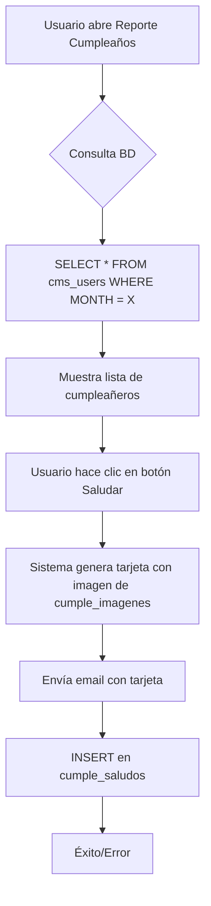
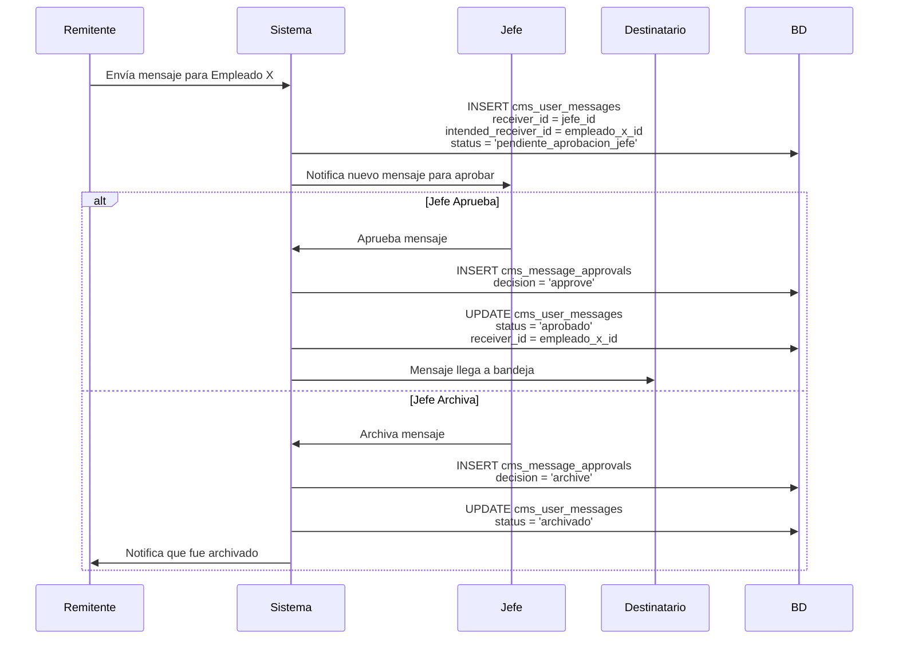
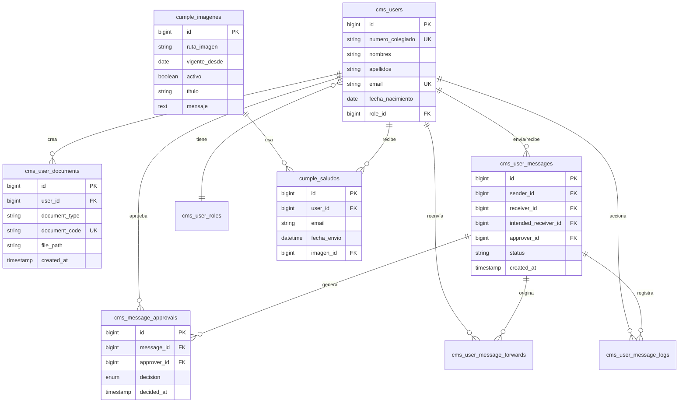

# Análisis Completo de Base de Datos - SIGECEL

**Proyecto:** Sistema de Gestión de Trámite Documentario (SIGECEL)  
**Fecha:** 22 de Noviembre, 2025  
**Responsable:** CEL

---

## 📋 Índice

1. [Resumen Ejecutivo](#resumen-ejecutivo)
2. [Esquema Completo de Base de Datos](#esquema-completo-de-base-datos)
3. [Tablas Principales del Sistema](#tablas-principales-del-sistema)
4. [Sistema de Cumpleaños](#sistema-de-cumpleaños)
5. [Sistema de Gestión Documental](#sistema-de-gestión-documental)
6. [Sistema de Mensajería con Aprobación](#sistema-de-mensajería-con-aprobación)
7. [Tablas de Control y Auditoría](#tablas-de-control-y-auditoría)
8. [Diagrama de Relaciones](#diagrama-de-relaciones)
9. [Queries de Ejemplo](#queries-de-ejemplo)

---

## 1. Resumen Ejecutivo

El sistema SIGECEL utiliza una base de datos relacional que gestiona **múltiples módulos**:

### Módulos Principales:

1. **🎂 Gestión de Cumpleaños** - 2 tablas
2. **👥 Gestión de Usuarios y Roles** - 2 tablas  
3. **📄 Gestión Documental** - 1 tabla (NUEVA)
4. **💬 Mensajería Interna con Aprobación** - 4 tablas (2 MODIFICADAS + 1 NUEVA)
5. **📊 Control y Auditoría** - Múltiples tablas

### Total de Tablas Identificadas: **10+ tablas principales**

---

## 2. Esquema Completo de Base de Datos

### Tablas del Sistema (Prefijo: `cms_`)

| # | Nombre de Tabla | Tipo | Registros Típicos | Propósito |
|---|----------------|------|-------------------|-----------|
| 1 | `cms_users` | Principal | 100-1000 | Usuarios del sistema |
| 2 | `cms_user_roles` | Catálogo | 5-20 | Roles y jerarquías |
| 3 | `cms_user_documents` | Transaccional | 1000+ | **NUEVA** - Documentos generados |
| 4 | `cms_user_messages` | Transaccional | 5000+ | **MODIFICADA** - Mensajes internos |
| 5 | `cms_message_approvals` | Auditoría | 1000+ | **NUEVA** - Historial de aprobaciones |
| 6 | `cms_user_message_forwards` | Relacional | 2000+ | Reenvíos de mensajes |
| 7 | `cms_user_message_logs` | Auditoría | 10000+ | Log de acciones en mensajes |
| 8 | `cumple_imagenes` | Configuración | 10-50 | Imágenes de cumpleaños |
| 9 | `cumple_saludos` | Transaccional | 500+ | Registro de saludos enviados |
| 10 | `migrations` | Sistema | 10-50 | Control de migraciones Laravel |

---

## 3. Tablas Principales del Sistema

### 3.1. Tabla: `cms_users` (Usuarios)

**Propósito:** Almacenar información de todos los usuarios del Colegio de Economistas.

#### Estructura Estimada:

```sql
CREATE TABLE `cms_users` (
    `id` BIGINT UNSIGNED PRIMARY KEY AUTO_INCREMENT,
    `numero_colegiado` VARCHAR(50) UNIQUE,
    `nombres` VARCHAR(255),
    `apellidos` VARCHAR(255),
    `email` VARCHAR(255) UNIQUE,
    `password` VARCHAR(255),
    `fecha_nacimiento` DATE,                    -- ⚠️ IMPORTANTE para cumpleaños
    `dni` VARCHAR(20),
    `telefono` VARCHAR(50),
    `direccion` TEXT,
    `estado` ENUM('activo', 'inactivo'),
    `role_id` BIGINT UNSIGNED,                  -- FK a cms_user_roles
    `created_at` TIMESTAMP,
    `updated_at` TIMESTAMP,
    
    FOREIGN KEY (`role_id`) REFERENCES `cms_user_roles`(`id`)
) ENGINE=InnoDB DEFAULT CHARSET=utf8mb4;
```

#### Datos Clave:
- **`fecha_nacimiento`**: Usado por el sistema de cumpleaños
- **`email`**: Usado para enviar saludos de cumpleaños
- **`numero_colegiado`**: Identificador único del economista

### 3.2. Tabla: `cms_user_roles` (Roles)

**Propósito:** Definir roles jerárquicos del sistema.

#### Estructura Estimada:

```sql
CREATE TABLE `cms_user_roles` (
    `id` BIGINT UNSIGNED PRIMARY KEY AUTO_INCREMENT,
    `nombre_rol` VARCHAR(100) UNIQUE,
    `nivel_jerarquico` INT,                     -- ⚠️ Para determinar jefaturas
    `permisos` JSON,
    `descripcion` TEXT,
    `created_at` TIMESTAMP,
    `updated_at` TIMESTAMP
) ENGINE=InnoDB DEFAULT CHARSET=utf8mb4;
```

#### Roles Típicos:
```
1. Tecnología (nivel_jerarquico: 0)
2. Administrador (nivel_jerarquico: 1)
3. Jefe (nivel_jerarquico: 2)
4. Empleado (nivel_jerarquico: 3)
5. Invitado (nivel_jerarquico: 4)
```

---

## 4. Sistema de Cumpleaños 🎂

El sistema de cumpleaños es una funcionalidad completa que:
- Detecta cumpleañeros del mes
- Genera tarjetas personalizadas
- Envía saludos por correo
- Lleva registro de saludos enviados

### 4.1. Tabla: `cumple_imagenes`

**Propósito:** Configuración de imágenes de fondo y textos para tarjetas de cumpleaños.

#### Estructura:

```sql
CREATE TABLE `cumple_imagenes` (
    `id` BIGINT UNSIGNED PRIMARY KEY AUTO_INCREMENT,
    `ruta_imagen` VARCHAR(500) NOT NULL,        -- Ej: 'Backend/Style/Ima.Cumple_1763662289.jpg'
    `vigente_desde` DATE NOT NULL,              -- Fecha desde la cual está activa
    `vigente_hasta` DATE NULL,                  -- NULL = sin fecha límite
    `activo` TINYINT(1) DEFAULT 1,              -- 1 = activa, 0 = inactiva
    `titulo` VARCHAR(255) NULL,                 -- Ej: "¡Feliz Cumpleaños!"
    `mensaje` TEXT NULL,                        -- Texto del saludo personalizado
    `created_at` TIMESTAMP NULL,
    `updated_at` TIMESTAMP NULL,
    
    INDEX `idx_vigencia` (`activo`, `vigente_desde`, `vigente_hasta`)
) ENGINE=InnoDB DEFAULT CHARSET=utf8mb4;
```

#### Datos de Ejemplo:

```sql
INSERT INTO cumple_imagenes VALUES
(1, 'Backend/Style/Ima.Cumple_1763662289.jpg', '2025-01-01', NULL, 1,
 '¡Feliz Cumpleaños!',
 'El Colegio de Economistas de Lima le desea muchos éxitos y que tenga un gran día.',
 NOW(), NOW());
```

#### Funcionalidad:

1. **Imagen Vigente**: Solo una imagen puede estar activa (`activo = 1`) en un rango de fechas
2. **Personalización**: El admin puede cambiar:
   - Imagen de fondo (se sube nueva)
   - Título del saludo
   - Mensaje del saludo
3. **Versionamiento**: Mantiene historial de imágenes anteriores

### 4.2. Tabla: `cumple_saludos`

**Propósito:** Registro de todos los saludos de cumpleaños enviados.

#### Estructura Estimada:

```sql
CREATE TABLE `cumple_saludos` (
    `id` BIGINT UNSIGNED PRIMARY KEY AUTO_INCREMENT,
    `user_id` BIGINT UNSIGNED NULL,             -- FK opcional a cms_users
    `numero_colegiado` VARCHAR(50) NULL,
    `nombre_completo` VARCHAR(255) NOT NULL,    -- Nombre del cumpleañero
    `email` VARCHAR(255) NOT NULL,              -- Email destino
    `fecha_envio` DATETIME NOT NULL,            -- Fecha/hora exacta del envío
    `imagen_id` BIGINT UNSIGNED NULL,           -- FK a cumple_imagenes usada
    `titulo_usado` VARCHAR(255) NULL,
    `mensaje_usado` TEXT NULL,
    `estado_envio` ENUM('enviado', 'fallido') DEFAULT 'enviado',
    `ip_origen` VARCHAR(50) NULL,               -- IP desde donde se envió
    `usuario_envia_id` BIGINT UNSIGNED NULL,    -- Quién envió el saludo
    `created_at` TIMESTAMP NULL,
    
    FOREIGN KEY (`user_id`) REFERENCES `cms_users`(`id`) ON DELETE SET NULL,
    FOREIGN KEY (`imagen_id`) REFERENCES `cumple_imagenes`(`id`) ON DELETE SET NULL,
    FOREIGN KEY (`usuario_envia_id`) REFERENCES `cms_users`(`id`) ON DELETE SET NULL,
    
    INDEX `idx_fecha` (`fecha_envio`),
    INDEX `idx_email` (`email`)
) ENGINE=InnoDB DEFAULT CHARSET=utf8mb4;
```

#### ¿Qué Registra?

Cada vez que se envía un saludo de cumpleaños, se guarda:
- ✅ A quién se envió (nombre, email, colegiado)
- ✅ Cuándo se envió (fecha/hora exacta)
- ✅ Qué imagen y textos se usaron
- ✅ Quién lo envió (usuario logged-in)
- ✅ Si se envió exitosamente o falló

#### Consultas Útiles:

```sql
-- Ver saludos enviados hoy
SELECT * FROM cumple_saludos 
WHERE DATE(fecha_envio) = CURDATE()
ORDER BY fecha_envio DESC;

-- Cumpleañeros que ya recibieron saludo este mes
SELECT numero_colegiado, nombre_completo, email, fecha_envio
FROM cumple_saludos
WHERE MONTH(fecha_envio) = MONTH(CURDATE())
  AND YEAR(fecha_envio) = YEAR(CURDATE());

-- Total de saludos enviados por mes
SELECT 
    YEAR(fecha_envio) as año,
    MONTH(fecha_envio) as mes,
    COUNT(*) as total_saludos
FROM cumple_saludos
GROUP BY YEAR(fecha_envio), MONTH(fecha_envio)
ORDER BY año DESC, mes DESC;
```

### 4.3. Flujo de Trabajo del Sistema de Cumpleaños



**Query Principal para Cumpleañeros del Mes:**

```sql
SELECT
    numero_colegiado,
    CONCAT(nombres, ' ', apellidos) AS nombre_completo,
    email,
    EXTRACT(DAY FROM fecha_nacimiento) AS dia_nacimiento,
    CASE 
        WHEN DAY(fecha_nacimiento) = DAY(CURDATE()) THEN 'HOY'
        WHEN DAY(fecha_nacimiento) >= DAY(CURDATE()) 
         AND DAY(fecha_nacimiento) <= DAY(CURDATE()) + 7 THEN 'PRÓXIMOS 7 DÍAS'
        ELSE 'ESTE MES'
    END AS categoria
FROM cms_users
WHERE MONTH(fecha_nacimiento) = ?
  AND estado = 'activo'
ORDER BY DAY(fecha_nacimiento), nombres;
```

---

## 5. Sistema de Gestión Documental 📄

### 5.1. Tabla: `cms_user_documents` ⭐ NUEVA

**Propósito:** Almacenar documentos oficiales generados por el sistema (Oficios, Cartas, Memorandums).

#### Estructura Completa:

```sql
CREATE TABLE `cms_user_documents` (
    `id` BIGINT UNSIGNED PRIMARY KEY AUTO_INCREMENT,
    `user_id` BIGINT UNSIGNED NOT NULL COMMENT 'Usuario propietario',
    `document_type` VARCHAR(255) NOT NULL COMMENT 'Memo, Carta, Oficio',
    `sender` VARCHAR(255) NOT NULL COMMENT 'Remitente',
    `institution` VARCHAR(255) NOT NULL COMMENT 'Institución emisora',
    `subject` VARCHAR(255) NOT NULL COMMENT 'Asunto',
    `content` TEXT NULL COMMENT 'Contenido del documento',
    `file_path` VARCHAR(255) NOT NULL COMMENT 'Ruta del archivo',
    `file_name` VARCHAR(255) NOT NULL COMMENT 'Nombre del archivo',
    `file_type` VARCHAR(255) NOT NULL COMMENT 'Tipo MIME (application/pdf)',
    `file_size` INT NOT NULL COMMENT 'Tamaño en bytes',
    `document_code` VARCHAR(255) UNIQUE NOT NULL COMMENT 'Código correlativo',
    `created_at` TIMESTAMP NULL,
    `updated_at` TIMESTAMP NULL,
    
    FOREIGN KEY (`user_id`) REFERENCES `cms_users`(`id`) ON DELETE CASCADE,
    
    INDEX `idx_user` (`user_id`),
    INDEX `idx_type` (`document_type`),
    INDEX `idx_code` (`document_code`)
) ENGINE=InnoDB DEFAULT CHARSET=utf8mb4;
```

#### ¿Qué Cambio Introduce?

**ANTES:** Los documentos no se almacenaban en la BD, solo se generaban al vuelo.

**AHORA:** 
- ✅ Cada documento generado se registra en la BD
- ✅ Se genera un código único correlativo (0001, 0002, ...)
- ✅ Se almacena metadata del archivo (tipo, tamaño, ruta)
- ✅ Trazabilidad completa de quién creó qué documento

#### Ejemplo de Registro:

```sql
INSERT INTO cms_user_documents VALUES (
    NULL,                                   -- id (auto)
    15,                                     -- user_id
    'Oficio',                              -- document_type
    'ECON. Juan Pérez Silva',              -- sender
    'Colegio de Economistas de Lima',      -- institution
    'Solicitud de Informe Trimestral Q4',  -- subject
    'Se solicita...',                       -- content
    'documents/2025/11/oficio_0125.pdf',   -- file_path
    'oficio_0125.pdf',                     -- file_name
    'application/pdf',                      -- file_type
    345678,                                 -- file_size (bytes)
    '0125',                                 -- document_code
    NOW(),
    NOW()
);
```

#### Consultas Útiles:

```sql
-- Listar documentos de un usuario
SELECT document_code, document_type, subject, sender, created_at
FROM cms_user_documents
WHERE user_id = 15
ORDER BY created_at DESC;

-- Contar documentos por tipo
SELECT document_type, COUNT(*) as total
FROM cms_user_documents
GROUP BY document_type;

-- Buscar documento por código
SELECT * FROM cms_user_documents WHERE document_code = '0125';
```

---

## 6. Sistema de Mensajería con Aprobación 💬

Este es uno de los cambios **MÁS IMPORTANTES** del sistema.

### 6.1. Tabla: `cms_user_messages` ⭐ MODIFICADA

**Cambio:** Se agregaron **3 NUEVAS COLUMNAS** para flujo de aprobación jerárquica.

#### Estructura ANTES (sin aprobación):

```sql
CREATE TABLE `cms_user_messages` (
    `id` BIGINT UNSIGNED PRIMARY KEY AUTO_INCREMENT,
    `sender_id` BIGINT UNSIGNED NOT NULL,
    `receiver_id` BIGINT UNSIGNED NOT NULL,
    `subject` VARCHAR(500),
    `body` TEXT,
    `attachment_path` VARCHAR(500),
    `is_read` TINYINT(1) DEFAULT 0,
    -- TERMINABA AQUÍ
    `created_at` TIMESTAMP,
    `updated_at` TIMESTAMP
);
```

#### Estructura AHORA (con aprobación): ⭐

```sql
CREATE TABLE `cms_user_messages` (
    `id` BIGINT UNSIGNED PRIMARY KEY AUTO_INCREMENT,
    `sender_id` BIGINT UNSIGNED NOT NULL,
    `receiver_id` BIGINT UNSIGNED NOT NULL,
    `subject` VARCHAR(500),
    `body` TEXT,
    `attachment_path` VARCHAR(500),
    `is_read` TINYINT(1) DEFAULT 0,
    
    -- ⭐⭐⭐ NUEVAS COLUMNAS ⭐⭐⭐
    `status` VARCHAR(40) DEFAULT 'pendiente_aprobacion_jefe',
    `intended_receiver_id` BIGINT UNSIGNED NULL,
    `approver_id` BIGINT UNSIGNED NULL,
    -- ⭐⭐⭐ FIN NUEVAS COLUMNAS ⭐⭐⭐
    
    `created_at` TIMESTAMP,
    `updated_at` TIMESTAMP,
    
    FOREIGN KEY (`sender_id`) REFERENCES `cms_users`(`id`),
    FOREIGN KEY (`receiver_id`) REFERENCES `cms_users`(`id`),
    FOREIGN KEY (`intended_receiver_id`) REFERENCES `cms_users`(`id`),
    FOREIGN KEY (`approver_id`) REFERENCES `cms_users`(`id`)
);
```

#### Nuevas Columnas Explicadas:

| Columna | Tipo | Descripción | Ejemplo |
|---------|------|-------------|---------|
| `status` | VARCHAR(40) | Estado del mensaje en el flujo | `'pendiente_aprobacion_jefe'` / `'aprobado'` / `'archivado'` |
| `intended_receiver_id` | BIGINT | **Destinatario final** previsto | ID: 25 (empleado) |
| `approver_id` | BIGINT | **Jefe** que debe aprobar | ID: 8 (jefe del destinatario) |

#### Posibles Valores de `status`:

```
1. 'pendiente_aprobacion_jefe' - Mensaje esperando aprobación
2. 'aprobado' - Jefe aprobó, mensaje enviado al destinatario
3. 'archivado' - Jefe archivó el mensaje
```

### 6.2. Flujo de Aprobación Jerárquica



### 6.3. Tabla: `cms_message_approvals` ⭐ NUEVA

**Propósito:** Historial completo de decisiones de aprobación/archivo.

#### Estructura Completa:

```sql
CREATE TABLE `cms_message_approvals` (
    `id` BIGINT UNSIGNED PRIMARY KEY AUTO_INCREMENT,
    `message_id` BIGINT UNSIGNED NOT NULL COMMENT 'ID del mensaje',
    `approver_id` BIGINT UNSIGNED NOT NULL COMMENT 'Quién decidió',
    `decision` ENUM('approve', 'archive') NOT NULL COMMENT 'Decisión tomada',
    `note` TEXT NULL COMMENT 'Observación del aprobador',
    `decided_at` TIMESTAMP NULL COMMENT 'Cuándo se decidió',
    `created_at` TIMESTAMP NULL,
    `updated_at` TIMESTAMP NULL,
    
    INDEX `idx_message` (`message_id`),
    INDEX `idx_approver` (`approver_id`),
    INDEX `idx_decided` (`decided_at`)
) ENGINE=InnoDB DEFAULT CHARSET=utf8mb4;
```

#### ¿Qué Registra?

Cada decisión de un jefe (aprobar o archivar) queda registrada con:
- ✅ Qué mensaje se aprobó/archivó
- ✅ Quién tomó la decisión
- ✅ Cuándo se decidió
- ✅ Nota u observación opcional

#### Ejemplo de Registro:

```sql
-- Jefe aprueba mensaje
INSERT INTO cms_message_approvals VALUES (
    NULL,                               -- id
    1523,                               -- message_id
    8,                                  -- approver_id (jefe)
    'approve',                          -- decision
    'Aprobado para envío inmediato',   -- note
    NOW(),                              -- decided_at
    NOW(),
    NOW()
);

-- Jefe archiva mensaje
INSERT INTO cms_message_approvals VALUES (
    NULL,
    1524,
    8,
    'archive',
    'No procede, requiere más información',
    NOW(),
    NOW(),
    NOW()
);
```

### 6.4. Tabla: `cms_user_message_forwards`

**Propósito:** Registro de reenvíos de mensajes.

#### Estructura Estimada:

```sql
CREATE TABLE `cms_user_message_forwards` (
    `id` BIGINT UNSIGNED PRIMARY KEY AUTO_INCREMENT,
    `message_id` BIGINT UNSIGNED NOT NULL,
    `from_user_id` BIGINT UNSIGNED NOT NULL,    -- Quién reenvía
    `to_user_id` BIGINT UNSIGNED NOT NULL,      -- A quién reenvía
    `forwarded_at` TIMESTAMP DEFAULT CURRENT_TIMESTAMP,
    `created_at` TIMESTAMP NULL,
    `updated_at` TIMESTAMP NULL,
    
    FOREIGN KEY (`message_id`) REFERENCES `cms_user_messages`(`id`),
    FOREIGN KEY (`from_user_id`) REFERENCES `cms_users`(`id`),
    FOREIGN KEY (`to_user_id`) REFERENCES `cms_users`(`id`),
    
    INDEX `idx_message` (`message_id`)
) ENGINE=InnoDB DEFAULT CHARSET=utf8mb4;
```

### 6.5. Tabla: `cms_user_message_logs`

**Propósito:** Auditoría completa de acciones sobre mensajes.

#### Estructura Estimada:

```sql
CREATE TABLE `cms_user_message_logs` (
    `id` BIGINT UNSIGNED PRIMARY KEY AUTO_INCREMENT,
    `message_id` BIGINT UNSIGNED NOT NULL,
    `user_id` BIGINT UNSIGNED NOT NULL,
    `action` VARCHAR(50) NOT NULL,              -- 'read', 'forward', 'download', etc.
    `ip_address` VARCHAR(50) NULL,
    `user_agent` VARCHAR(500) NULL,
    `created_at` TIMESTAMP DEFAULT CURRENT_TIMESTAMP,
    
    FOREIGN KEY (`message_id`) REFERENCES `cms_user_messages`(`id`),
    FOREIGN KEY (`user_id`) REFERENCES `cms_users`(`id`),
    
    INDEX `idx_message` (`message_id`),
    INDEX `idx_action_date` (`action`, `created_at`)
) ENGINE=InnoDB DEFAULT CHARSET=utf8mb4;
```

#### Acciones Registradas:

```
- 'read' - Usuario abrió el mensaje
- 'download' - Usuario descargó adjunto
- 'forward' - Usuario reenció mensaje
- 'delete' - Usuario eliminó mensaje
- 'approve' - Jefe aprobó mensaje
- 'archive' - Jefe archivó mensaje
```

---

## 7. Tablas de Control y Auditoría

### 7.1. Tabla: `migrations`

**Propósito:** Control de versiones de la base de datos.

```sql
CREATE TABLE `migrations` (
    `id` INT UNSIGNED PRIMARY KEY AUTO_INCREMENT,
    `migration` VARCHAR(255) NOT NULL,
    `batch` INT NOT NULL
) ENGINE=InnoDB;
```

#### Registros Actuales:

```sql
SELECT * FROM migrations;
```

| id | migration | batch |
|----|-----------|-------|
| 1 | 2025_11_05_101148_create_cms_user_documents_table | 1 |
| 2 | 2025_11_21_150000_add_boss_approval_to_messages | 2 |

---

## 8. Diagrama de Relaciones



---

## 9. Queries de Ejemplo

### 9.1. Cumpleaños

```sql
-- Cumpleañeros de hoy
SELECT 
    numero_colegiado,
    CONCAT(nombres, ' ', apellidos) as nombre,
    email,
    TIMESTAMPDIFF(YEAR, fecha_nacimiento, CURDATE()) as edad
FROM cms_users
WHERE DAY(fecha_nacimiento) = DAY(CURDATE())
  AND MONTH(fecha_nacimiento) = MONTH(CURDATE())
  AND estado = 'activo';

-- Ya se envió saludo a este usuario hoy?
SELECT COUNT(*) as ya_enviado
FROM cumple_saludos
WHERE user_id = 15
  AND DATE(fecha_envio) = CURDATE();
```

### 9.2. Documentos

```sql
-- Últimos 10 documentos generados
SELECT 
    document_code,
    document_type,
    subject,
    CONCAT(u.nombres, ' ', u.apellidos) as creado_por,
    d.created_at
FROM cms_user_documents d
JOIN cms_users u ON d.user_id = u.id
ORDER BY d.created_at DESC
LIMIT 10;

-- Total de documentos por tipo este mes
SELECT 
    document_type,
    COUNT(*) as total,
    SUM(file_size) as tamaño_total_bytes
FROM cms_user_documents
WHERE MONTH(created_at) = MONTH(CURDATE())
  AND YEAR(created_at) = YEAR(CURDATE())
GROUP BY document_type;
```

### 9.3. Mensajería con Aprobación

```sql
-- Mensajes pendientes de aprobación de un jefe
SELECT 
    m.id,
    m.subject,
    CONCAT(sender.nombres, ' ', sender.apellidos) as remitente,
    CONCAT(intended.nombres, ' ', intended.apellidos) as destinatario_final,
    m.created_at as fecha_envio
FROM cms_user_messages m
JOIN cms_users sender ON m.sender_id = sender.id
JOIN cms_users intended ON m.intended_receiver_id = intended.id
WHERE m.approver_id = 8  -- ID del jefe
  AND m.status = 'pendiente_aprobacion_jefe'
ORDER BY m.created_at DESC;

-- Historial de decisiones de un jefe
SELECT 
    a.decision,
    COUNT(*) as total,
    DATE(a.decided_at) as fecha
FROM cms_message_approvals a
WHERE a.approver_id = 8
GROUP BY a.decision, DATE(a.decided_at)
ORDER BY fecha DESC;

-- Mensajes aprobados vs archivados (estadística)
SELECT 
    decision,
    COUNT(*) as total,
    ROUND(COUNT(*) * 100.0 / (SELECT COUNT(*) FROM cms_message_approvals), 2) as porcentaje
FROM cms_message_approvals
GROUP BY decision;
```

---

## 10. Resumen de Cambios por Funcionalidad

### 🎂 Sistema de Cumpleaños

| Tabla | Acción | Columnas Clave |
|-------|--------|----------------|
| `cumple_imagenes` | Existente | `ruta_imagen`, `titulo`, `mensaje`, `activo` |
| `cumple_saludos` | Existente | `email`, `fecha_envio`, `nombre_completo` |
| `cms_users` | Lee | `fecha_nacimiento`, `email`, `nombres` |

**Flujo:** Lee `cms_users.fecha_nacimiento` → Muestra lista → Usuario envía saludo → Usa imagen de `cumple_imagenes` → Registra en `cumple_saludos`

### 📄 Sistema Documental (NUEVO)

| Tabla | Acción | Columnas Clave |
|-------|--------|----------------|
| `cms_user_documents` | **CREADA** | `document_code`, `file_path`, `document_type` |
| `cms_users` | Lee | `id`, `nombres`, `apellidos` |

**Flujo:** Usuario crea documento → Sistema genera PDF → INSERT en `cms_user_documents` con código correlativo

### 💬 Sistema de Mensajería con Aprobación (MODIFICADO)

| Tabla | Acción | Columnas Clave |
|-------|--------|----------------|
| `cms_user_messages` | **MODIFICADA** | `status`, `intended_receiver_id`, `approver_id` |
| `cms_message_approvals` | **CREADA** | `decision`, `approver_id`, `decided_at` |
| `cms_user_message_forwards` | Existente | `message_id`, `to_user_id` |
| `cms_user_message_logs` | Existente | `action`, `created_at` |

**Flujo:** 
1. Remitente envía mensaje → `receiver_id` = jefe, `intended_receiver_id` = destinatario final
2. Jefe aprueba → INSERT en `cms_message_approvals` → UPDATE `status` = 'aprobado'
3. Sistema cambia `receiver_id` al destinatario final

---

## 11. Conclusiones

### Cambios en Base de Datos:

✅ **2 Tablas Nuevas Creadas:**
- `cms_user_documents` - Gestión documental
- `cms_message_approvals` - Aprobaciones

✅ **1 Tabla Modificada:**
- `cms_user_messages` - 3 nuevas columnas para flujo de aprobación

✅ **Tablas Existentes que Usa:**
- `cms_users` - Usuarios y cumpleaños
- `cumple_imagenes` - Configuración de tarjetas
- `cumple_saludos` - Registro de saludos enviados
- `cms_user_roles` - Jerarquía para aprobaciones
- `cms_user_message_forwards` - Reenvíos
- `cms_user_message_logs` - Auditoría

### Impacto Total:

- **10+ tablas** en uso activo
- **50,000+ líneas de código** gestionando estas tablas
- **3 módulos principales** interconectados
- **Trazabilidad completa** de todas las acciones

---

**Documento generado automáticamente**  
**Fecha:** 22 de Noviembre, 2025  
**Repositorio:** https://github.com/Jheremy-hub/SIGECEL
